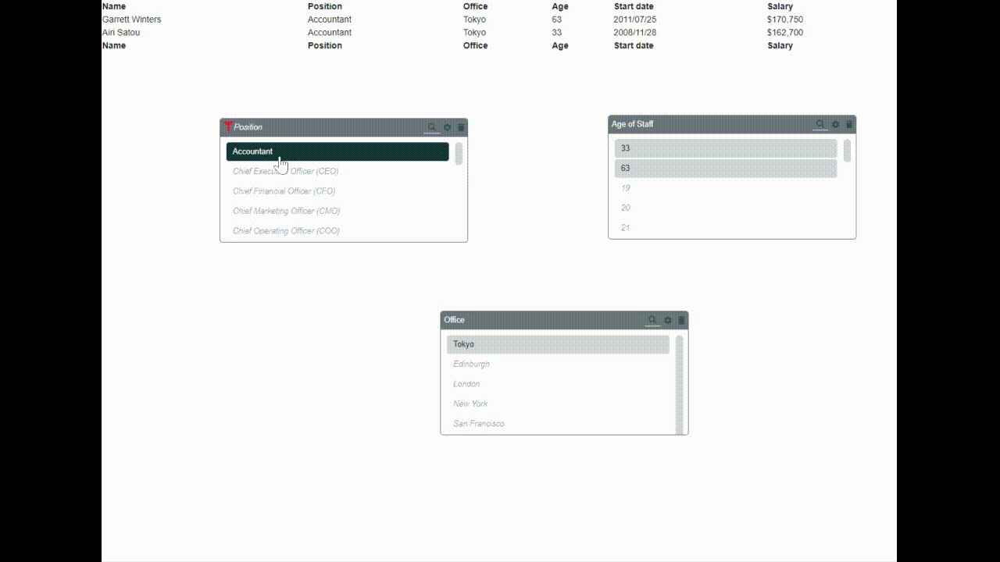

# Slicer-JS

Provide the Excel slicer capability to websites. Simple implementation to help filter table or datasets using visual feedback.



# See it in action

Visit my cloud-based business insights application [demo.biznous.net](https://demo.biznous.net) to see how it is being used in production.

# Dependencies

- jQuery (3.4.1) - so I don't need to worry about cross browser issues LOL
- jQuery-UI (1.12.1) - for resize and draggable (cause HTML5 drag-n-drop scares me)
- Bootstrap (4.0.0) - mainly used for the [style](#style) option
- FontAwesome (5.10.0) - button icons on slicer title bar

# Install

```html
<link type="text/css" rel="stylesheet" href="../dist/css/slicer-js.min.css" />
<script type="text/javascript" src="../dist/js/slicer-js.min.js"></script>
```

# Usage

```javascript
<script type="application/javascript">
    document.addEventListener('DOMContentLoaded', function(){
        //BASIC CREATE
        (new Slicer())
                .attach({
                            container: $('#example'),
                            field: 'Position'})
                .make_editable();

        //ALL OPTIONS CREATE
        (new Slicer())
                .attach({
                            container: $('#example'),
                            dataset: null,
                            style: 'secondary',
                            title: 'Age of Staff', 
                            field: 'Age',
                            top: '100px',
                            left: '300px',
                            width: '180px',
                            height: '300px',
                            on_change: function(){
                                console.log('START save change to age')
                            },
                            on_before_change: function(){
                                console.log('STOP save change to age')
                            }
                        })
                .make_editable();
    });

</script>
```

# Options

## container 

> Optional
>
> Only ommit this value (or set it to `null`) if you are providing the [`dataset`](#dataset) value.
>
> Container into which the slicer should be created.
> If no dataset is provided, it will assume the container is an HTML table and then convert it to a dataset.

## field 

> **Mandatory**
> 
> This is the field whose unique list of value should be shown in the slicer

## dataset 

> Optional
>
> Default : `null`
> 
> Only omit this value if you are providing an HTML table in the [`container`](#container) field.
> 
> Object representing the data to render into the slicer.
> ```js
> {
>    name    : "unique-name",   //string value
>    header  : [...],           //array representing the header row
>    rows    : [[...]],         //array of arrays representing the data rows in the table
> }
> ```

## title 

> Optional
> 
> Default : When omited it will use the [`field`](#field) value
> 
> Title to display for the slicer. When the title is omited it will use the field value.


## width 

> Optional
> 
> Default : `400px`
> 
> Width of slicer

## height 

> Optional
> 
> Default : `200px`
> 
> Height of slicer

## top 

> Optional
> 
> Default : `200px`
> 
> Absolute "top" position relative to the page

## left 

> Optional
> 
> Default : `200px`
> 
> Absolute "left" position relative to the page

## style 

> Optional
> 
> Default : `primary`
> 
> This is a combination of the "default" bootstrap themes and some custom themes which is defined in the css files provided
> possible values are:
> 
> **Bootstrap colors**
> * light
> * primary
> * warning
> * danger
>
> **Custom colors**
> * heritage-green
> * fresh-green
> * future-green
> * sky
> * sun
> * naartjie
> * cerise

## on_change 

> Optional
>
>
> Callback function after the user made a selection on the page
> ```js
> function(){
>    console.log('call after user selected items on slicer');
> }
> ```

## on_before_change 

> Optional
>
>
> Callback function BEFORE the user selection is applied to the table/dataset
> ```js
> function(){
>    console.log('call made before selection is applied');
> }
> ```

# Related

This is one of the components used in the [biznous.net](https://biznous.net) platform

# Licence

The javascript component slicer-js is released under the [MIT license](https://opensource.org/licenses/MIT)